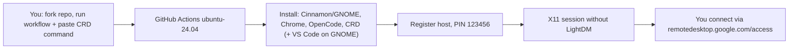

# RICH Linux CRD

**English** | [Bahasa Indonesia](README.id.md)

> Ubuntu 24.04/26.04 on GitHub Actions + Chrome Remote Desktop. Pick your desktop — lightweight **Cinnamon**, stable **GNOME**, or ultra-fast **XFCE (Beta)** — and connect from anywhere with a PIN.

<p align="center">
  
</p>

<p align="center">
  <a href="https://github.com/kiraadityaa/rich-linux-crd/actions/workflows/cinnamon.yml"></a>
  <a href="https://github.com/kiraadityaa/rich-linux-crd/actions/workflows/gnome.yml"></a>
  
  
  
  
  
  
  
  
  
  
  
  
</p>


Image sources: workflow status badges from GitHub Actions, technology badges from Shields.io, banner from [`assets/rich-linux-crd-banner.svg`](assets/rich-linux-crd-banner.svg) and architecture diagram from [`assets/architecture.svg`](assets/architecture.svg) in this repository. No external stock photography.

---

## Overview

| Feature | Detail |
|---|---|
| Three desktops | Cinnamon Full (approx. 1 GB), GNOME Ubuntu Desktop (approx. 2 GB), or **XFCE (Beta)** — the lightest, fastest option |
| XFCE Beta | New workflow `xfce.yml` on the **ubuntu-26.04 public-preview** image — XFCE + xfwm4 for maximum responsiveness (beta: preview image, `/dev/kvm` not yet verified there) |
| Instant remote access | Chrome Remote Desktop, default PIN `123456` (customizable via secret) |
| Dev tools included | Google Chrome, OpenCode CLI + OpenCode Desktop (all three desktops); **VS Code** pre-installed in GNOME (install manually in Cinnamon or XFCE via `sudo apt-get install code`) |
| Session length | Automatic keep-alive per workflow run (up to 6 hours) |
| Crash-resistant session | Direct `exec` without `Xsession`/`lightdm` wrappers + Mesa software rendering (fixes the "Oh no! Something has gone wrong" screen) |
| Disconnect-safe upgrades | [`safe-upgrade`](scripts/safe-upgrade.sh) helper inside the session (holds critical packages: CRD/Chrome, desktop shell, systemd/init, kernel); GNOME workflow also runs full `upgrade` at build time |
| Quiet installs | Needrestart apt hook disabled (`/etc/apt/apt.conf.d/99needrestart` removed) → no "Scanning processes..." output and no auto service restarts during any install/upgrade |
| No snap bloat | `snapd` + transitional `thunderbird`/`firefox` deb purged and held → no `snap` daemon, no 30-minute thunderbird-snap retry hang during desktop installs, and nothing can silently reinstall snaps; tradeoff: `snap install`/Snap Store unavailable (GNOME Software shows apt sources only) |
| Catppuccin theme + Zafiro icons | Cinnamon & XFCE workflows auto-extract `cinnamon-theme.zip` → Catppuccin-B-LB-Dark theme + Zafiro-Nord-Black icon theme (Cinnamon applied via dconf, XFCE via xfconf) |
| Auto resolution 1600x1200 (all three desktops) | Dual-layer: Xorg dummy config + xrandr retry auto-detect loop in the session file, plus an autostart fallback script |
| KVM virtualization | `/dev/kvm` exposed on the runner + QEMU/libvirt stack (virt-manager, GNOME Boxes) preinstalled; `runner` in `kvm` + `libvirt` groups → hardware-accelerated VMs inside the remote desktop |
| Audio streaming (all three desktops) | Chrome Remote Desktop natively streams audio from the remote session — no extra PulseAudio/PipeWire config needed (XFCE installs `pulseaudio` explicitly) |
| Smooth remote experience | Mesa software rendering, direct exec session, disabled screensaver/lock → responsive desktop without crashes |
| Zero-config setup | 4-step Quick Start: fork repo → copy CRD command → run workflow → connect with PIN. No SSH, no port forwarding, no firewall config |
| Wallpaper included | Catppuccin **Black Unicat** preinstalled for the `runner` user on all three desktops |
| Desktop layout | Cinnamon: clean desktop (no shortcuts) — tools in the app menu; GNOME: shortcuts (Antigravity, VS Code, OpenCode, Safe Upgrade) |

---

## Features at a glance

### Easy Setup — 4 Steps, 5 Minutes

No SSH keys, no port forwarding, no firewall rules. Fork this repository, copy a CRD command from Google's page, paste it into a GitHub Actions workflow in your fork, and connect from your browser. The entire stack — desktop environment, browser, code editor, and remote access — installs automatically.

### Smooth Remote Experience

All three desktops are configured for headless operation:

- **Direct exec** session files bypass LightDM/Xsession wrappers that cause the "Oh no! Something has gone wrong" crash
- **Mesa software rendering** (`LIBGL_ALWAYS_SOFTWARE=1`) ensures the desktop renders correctly on GitHub Actions runners without a physical GPU
- **Screensaver and lock disabled** — the session stays alive and responsive, never timing out or locking you out
- **Auto resolution 1600x1200** (all three desktops) — xrandr retry auto-detect in the session file applies the optimal resolution, with an autostart fallback script

### Audio Streaming

Chrome Remote Desktop streams audio from the remote session to your browser automatically. No PulseAudio or PipeWire configuration is needed — all three desktops use the default Ubuntu audio stack (XFCE installs `pulseaudio` explicitly), and CRD handles the rest. Play music, watch videos, or join video calls — audio works out of the box.

### Catppuccin Theme & Zafiro Icons (Cinnamon & XFCE)

The Cinnamon & XFCE workflows ship with a premium look out of the box:

- **Catppuccin-B-LB-Dark** — a dark GTK/Cinnamon theme with smooth, rounded UI elements
- **Zafiro-Nord-Black** — a flat, minimal icon theme based on the Nord color palette
- **Catppuccin Black Unicat** wallpaper — pre-set as the desktop background
- Theme and icons are applied automatically (Cinnamon via dconf, XFCE via xfconf), with an autostart fallback to persist across sessions

### Built-in Dev Tools

| Tool | Purpose | Available in |
|---|---|---|
| Google Chrome | Full browser with extensions, profiles, and DevTools | Cinnamon, GNOME & XFCE |
| VS Code | Code editor with terminal, extensions, and remote development | **GNOME** only; install in Cinnamon or XFCE via `sudo apt-get install code` |
| OpenCode CLI + Desktop | AI-powered coding assistant | Cinnamon, GNOME & XFCE |
| Virtual Machine tools | QEMU/KVM, libvirt (`virsh`, `virt-install`), Virtual Machine Manager, GNOME Boxes | Cinnamon, GNOME & XFCE |

GNOME provides desktop shortcuts (Antigravity, VS Code, OpenCode, Safe Upgrade). Cinnamon & XFCE use a clean desktop with tools in the application menu.

### KVM Hardware-Accelerated Virtualization

This GitHub-hosted runner exposes `/dev/kvm` (Intel VT-x), so the desktop can run **real, hardware-accelerated virtual machines** — not slow software emulation. All three workflows install the full QEMU/libvirt stack and give the `runner` user direct access:

- **QEMU/KVM** (`qemu-system-x86_64`, `/dev/kvm`) — hardware-accelerated CPU virtualization
- **libvirt** (`libvirtd`, `virsh`, `virt-install`) — VM management daemon, enabled and started at build time
- **Virtual Machine Manager** (`virt-manager`) — full-featured GUI to create/manage VMs
- **GNOME Boxes** (`gnome-boxes`) — simple, beginner-friendly GUI

Advantages:

- Run any ISO (other Linux distros, BSD, evaluation Windows ISOs) inside your remote desktop at near-native CPU speed
- Nested virtualization is enabled — useful when testing VT-x-dependent software (a VM inside a VM works)
- Zero setup — `runner` already belongs to the `kvm` and `libvirt` groups; just open **Virtual Machine Manager** or **GNOME Boxes** → New VM → pick your ISO

Honest limitations:

- KVM does **not** accelerate the CRD session's own rendering — the desktop still uses Mesa software rendering (no physical GPU). Do not expect faster desktop UI or GPU acceleration from this feature.
- No GPU passthrough. QEMU guests are best configured with a software/virtio display (e.g. `virtio-gpu` / QXL); 3D acceleration inside guests is limited.
- The runner's vCPU/RAM budget is shared with your live CRD session — keep VMs modest in size.
- `/dev/kvm` is present on the runner used to develop this project, but **not every GitHub-hosted runner guarantees it**. If `/dev/kvm` is missing, the workflow only prints a warning (it does not fail) and VMs would fall back to slow QEMU TCG emulation.

### XFCE (Beta) — Fastest Desktop

For users who want maximum responsiveness, try the new XFCE workflow. It runs on the **`ubuntu-26.04` public-preview** runner image and ships a minimal XFCE + xfwm4 desktop (`xfce4`, `xfce4-session`, `xfwm4`, `xfce4-terminal`, `thunar`) — no extra weight such as obs-studio or a file-manager duplicate. Everything else matches the family: direct-exec CRD session, 1600x1200 auto-resolution, safe-upgrade, no snaps, and the KVM stack (warn-only when `/dev/kvm` is unavailable).

Honest beta caveats:
- The `ubuntu-26.04` image is a GitHub **public preview** (introduced June 2026) — tool versions can differ from 24.04 and individual pieces can be unstable, with possible queueing during capacity ramp-up.
- `/dev/kvm` is **not yet verified** on the 26.04 image; the workflow degrades to a warning if it is absent.
- Theming is applied through `xfconf` (XFCE's settings daemon) instead of dconf/gsettings.
- Start with the CRD device name shown as **"xfce"** in remotedesktop.google.com/access.

### Disconnect-Safe Upgrades

Running `sudo apt upgrade` inside a CRD session drops the connection (it restarts CRD/GNOME/systemd services). The [`safe-upgrade`](scripts/safe-upgrade.sh) helper solves this:

- Holds critical packages (CRD, desktop shell, systemd, kernel)
- Upgrades everything else safely
- A MOTD warning in all three workflows (plus a **Safe Upgrade** shortcut on GNOME) prevents accidental `apt upgrade`

`safe-upgrade` also ships with safety tooling beyond the basic upgrade:

- **Version diff** — shows every upgraded package as `name: old_version → new_version`, plus newly installed and removed packages
- **`--cleanup`** — runs `apt-get autoremove` after the upgrade to reclaim disk space
- **Rollback tracking** — snapshots all package versions before and after to `/var/log/safe-upgrade-pre.log` and `/var/log/safe-upgrade-post.log`
- **Summary table** — color-coded overview of upgraded / held / removed counts and duration
- **Kernel reboot check** — warns you when a newer kernel was installed than the one currently running
- **Interrupt-safe** — a `SIGINT`/`SIGTERM`/`EXIT` trap automatically releases the package holds if you abort mid-upgrade

---

## How it works



---

## Quick Start (5 minutes)

Workflows use `workflow_dispatch`, so **you must run them from your own fork** — GitHub only allows you to trigger Actions on repositories you control.

### 0. Fork this repository

1. Go to <https://github.com/kiraadityaa/rich-linux-crd>.
2. Click **Fork** (top-right) to create a copy under your GitHub account.
3. All following steps happen in **your fork**.

### 1. Get the CRD host command

1. Open <https://remotedesktop.google.com/headless> in a browser logged in to your Google account.
2. Click **Begin** → **Next** → **Authorize**.
3. Copy the **Debian Linux** command shown (starts with `DISPLAY= ... start-host ...`). Do not run it locally — just copy.

### 2. Run the workflow

1. Open the **Actions** tab in **your fork**.
2. Select a workflow:
   - **RICH LINUX (Cinnamon + Chrome Remote Desktop)** → file `.github/workflows/cinnamon.yml`
   - **RICH LINUX (GNOME + Chrome Remote Desktop)** → file `.github/workflows/gnome.yml`
   - **RICH LINUX (XFCE Beta + Chrome Remote Desktop)** → file `.github/workflows/xfce.yml` (public-preview `ubuntu-26.04`, **beta**)
3. Click **Run workflow**, paste the CRD command into the `crd_host_command` field, click **Run**.
4. Wait approx. 5–10 minutes until the log shows `CHROME REMOTE DESKTOP READY`.

### 3. Connect

1. Open <https://remotedesktop.google.com/access>.
2. Click your device → enter the PIN:
   - Default: `123456`
   - Custom: create a repository secret named `CRD_PIN` (minimum 6 digits) before running the workflow.
3. You are in the desktop.

---

## Cinnamon vs GNOME

|  | Cinnamon (`cinnamon.yml`) | GNOME (`gnome.yml`) |
|---|---|---|
| Look and feel | Classic, Linux Mint style | Modern Ubuntu style |
| Install size | Approx. 1 GB | Approx. 2 GB |
| Theme | Catppuccin-B-LB-Dark + Zafiro-Nord-Black icons (auto-installed) | Default Adwaita |
| Resolution | Auto 1600x1200 via xrandr (retry + autostart fallback) | Auto 1600x1200 via xrandr (retry + autostart fallback) |
| CRD session | `exec /usr/bin/cinnamon-session --session cinnamon` + `LIBGL_ALWAYS_SOFTWARE=1` | `exec /usr/bin/gnome-session --session=ubuntu` (auto-detects `ubuntu` > `gnome` > `gnome-xorg`) + `LIBGL_ALWAYS_SOFTWARE=1` |
| Display manager | Not used (headless) | Not used (headless) |
| Desktop shortcuts | None (clean desktop) | Antigravity, VS Code, OpenCode, Safe Upgrade |
| Dev tools | Chrome + OpenCode CLI/Desktop | Chrome + VS Code + OpenCode CLI/Desktop |
| Virtualization | QEMU/KVM + libvirt + virt-manager + GNOME Boxes | QEMU/KVM + libvirt + virt-manager + GNOME Boxes |
| Screensaver, lock, suspend | Disabled (autostart + dconf no-lock, packages kept installed) | Disabled (dconf + gsettings no-lock, suspend set to `nothing`) |
| Wallpaper | Catppuccin Black Unicat (via `org.cinnamon.desktop.background`) | Catppuccin Black Unicat (via `org.gnome.desktop.background`) |
| Upgrades | `safe-upgrade` in session (no build-time full upgrade — add via customization) | Build-time full upgrade + `safe-upgrade` in session |
| Best for | Mint-style look, lighter footprint, premium theme | Maximum stability |

> [!NOTE]
> **XFCE (Beta)** (`xfce.yml`) is the third desktop choice — the fastest/most responsive option. It runs on the public-preview `ubuntu-26.04` image; details and honest beta caveats are in the [XFCE (Beta)](#xfce-beta--fastest-desktop) section.

---

## Troubleshooting

### Error: "Oh no! Something has gone wrong"

Symptom: the PIN is correct and the connection succeeds, but the screen shows a sad face with a **Log Out** button.

Cause: the session file used a `lightdm-session` wrapper that requires a physical LightDM seat — which does not exist on the headless CRD runner.

Fix already applied in all three workflows:

```bash
# Cinnamon
DESKTOP_SESSION=cinnamon
XDG_CURRENT_DESKTOP=X-Cinnamon
XDG_SESSION_TYPE=x11
XDG_RUNTIME_DIR=/run/user/$(id -u)
LIBGL_ALWAYS_SOFTWARE=1
exec /usr/bin/cinnamon-session --session cinnamon

# GNOME (auto-detects ubuntu > gnome > gnome-xorg)
DESKTOP_SESSION=ubuntu
XDG_CURRENT_DESKTOP=ubuntu:GNOME
XDG_SESSION_TYPE=x11
XDG_RUNTIME_DIR=/run/user/$(id -u)
LIBGL_ALWAYS_SOFTWARE=1
MUTTER_DEBUG_FORCE_SOFTWARE_RENDER=1
exec /usr/bin/gnome-session --session=ubuntu

# XFCE (Beta)
DESKTOP_SESSION=xfce
XDG_CURRENT_DESKTOP=XFCE
XDG_SESSION_TYPE=x11
XDG_RUNTIME_DIR=/run/user/$(id -u)
LIBGL_ALWAYS_SOFTWARE=1
exec /usr/bin/xfce4-session
```

Plus Mesa/LLVMPipe packages for software rendering, with no conflicting LightDM installation.

### Session drops after `apt upgrade` and cannot reconnect

Symptom: after `sudo apt update && sudo apt upgrade -y`, the session drops suddenly and reconnecting fails. The log shows systemd restarting something.

Cause: the upgrade also raises `chrome-remote-desktop` / `gnome-shell` / `mutter` / `gdm3` / `systemd` / `dbus`, then restarts their services — killing the running X session mid-upgrade.

> [!WARNING]
> Never run plain `sudo apt upgrade -y` inside the CRD session. It restarts the display stack and drops the connection (recovery requires re-running the workflow).

| Need | Command |
|---|---|
| Safe daily upgrade (in the CRD terminal) | `safe-upgrade` (automatically holds critical packages, upgrades the rest) |
| Preview without changing anything | `safe-upgrade --check` |
| Upgrade + autoremove (reclaim disk) | `safe-upgrade --cleanup` |
| Upgrade CRD/Chrome/desktop too (WILL DISCONNECT) | `safe-upgrade --allow-crd-restart` / `safe-upgrade --include-desktop` |
| Get critical upgrades without disconnecting | Re-run the Actions workflow (GNOME runs a full `upgrade` at build time, before CRD starts) |
| See which packages changed | Check the version diff in `safe-upgrade` output, or diff `/var/log/safe-upgrade-pre.log` vs `/var/log/safe-upgrade-post.log` |

> [!TIP]
> Implementation: [`scripts/safe-upgrade.sh`](scripts/safe-upgrade.sh). It ships with a color-coded **summary table**, **version diff** (old → new), **rollback logs** (`/var/log/safe-upgrade-pre.log` & `post.log`), a **kernel reboot check**, and an **interrupt-safe trap** that auto-releases package holds. The GNOME workflow also installs a **Safe Upgrade** desktop shortcut; all three workflows set a MOTD warning.

---

## Repository structure

```
rich-linux-crd/
├── .github/
│   └── workflows/
│       ├── cinnamon.yml   # RICH LINUX (Cinnamon + CRD)
│       ├── gnome.yml      # RICH LINUX (GNOME + CRD)
│       └── xfce.yml       # RICH LINUX (XFCE BETA + CRD)
├── assets/
│   ├── architecture.svg        # Architecture diagram used in this README
│   ├── cinnamon-theme.zip      # Catppuccin theme + Zafiro icons (auto-installed by the Cinnamon & XFCE workflows)
│   ├── rich-linux-crd-banner.svg
│   └── rich-linux-crd-logo.svg
├── opencode-setup/
│   └── opencode-skills.md      # OpenCode agent skills + Context7 setup guide
├── scripts/
│   └── safe-upgrade.sh  # Safe in-session upgrade (replacement for apt upgrade), with version diff,
│                        # --cleanup autoremove, rollback logs, summary table, kernel reboot check
├── README.md            # This file (English)
├── README.id.md         # Indonesian summary
├── AGENTS.md            # Agent/dev continuation guide (Bahasa Indonesia)
├── LICENSE
└── .gitignore
```

---

## Customization

| Need | How |
|---|---|
| Change PIN | Create a `CRD_PIN` repository secret (Settings → Secrets → Actions), 6+ digits |
| Change the `runner` user password | Edit the `echo "runner:...` line in the workflow (default `root` on all three workflows) |
| Add applications | Add a new `apt-get install` step before the CRD step, e.g. `apt-get install -y code` to add VS Code to Cinnamon (needrestart is already disabled, so it stays quiet) |
| Change the wallpaper | Edit the download URL in the **Set Wallpaper** step of the workflow |
| Change the display resolution | Edit the Xorg dummy config and xrandr commands in the **Configure CRD Cinnamon Session** step (STEP 08) of `cinnamon.yml` |
| Manage virtual machines | Open **Virtual Machine Manager** or **GNOME Boxes** from the app menu → New VM → pick an ISO (`runner` already has `/dev/kvm` access) |
| Change the theme | Replace `cinnamon-theme.zip` in `assets/` with your own theme archive (must contain `themes/` and `icons/` directories) |
| Extend duration | Edit `sleep 21600` in the **Keep Alive** step (max 6 hours due to the Actions limit) |

---

## Notes

- Workflows use `workflow_dispatch` — they only run when you trigger them manually.
- GitHub only lets you run Actions on repos you control — **fork this repository first**, then trigger the workflows from your fork.
- Never commit your CRD command to the repository (it contains a one-time auth code). Paste it only into the workflow input.
- The default PIN `123456` is for convenience only. For serious use, set a custom `CRD_PIN`.
- The GitHub Actions free tier has monthly minute limits — monitor Settings → Billing.
- The Cinnamon workflow automatically installs the Catppuccin theme and Zafiro icons from `assets/cinnamon-theme.zip` — no manual setup required.
- Display resolution is set to 1600x1200 via xrandr auto-detection in the session file (all three desktops).
- KVM is exposed on this GitHub-hosted runner (`/dev/kvm`, Intel VT-x, nested = enabled) — used for **hardware-accelerated VMs** inside the desktop. It does not accelerate the CRD rendering itself, and availability can vary across GitHub runner fleets: if `/dev/kvm` is absent, the workflow only warns (no failure) and VMs would fall back to QEMU TCG (slow).
- Snap is intentionally **removed and held** in all three workflows. The reason: Ubuntu 24.04's `thunderbird` is a *transitional deb* whose post-install script forces `snap install thunderbird` — on a runner without proper snap-store access this retried for 30 minutes, stalling every desktop install. `snapd`, `thunderbird` (snap-transitional), and `firefox` are purged after install and held so nothing can silently reinstall them. Honest tradeoffs: `snap install` is unavailable, the Snap Store no longer appears in GNOME Software (apt sources remain), and `firefox` is removed — Google Chrome stays as the browser. If you ever need a full browser alternative, install Firefox ESR or Chromium via apt.
- The **XFCE Beta** workflow (`xfce.yml`) uses the `ubuntu-26.04` runner image which is a GitHub **public preview** (announced June 2026). Expect it to be slightly less battle-tested than the 24.04 workflows; report issues to the issue tracker with the workflow name `xfce.yml`.
- `safe-upgrade` snapshots package versions before/after each run to `/var/log/safe-upgrade-pre.log` and `/var/log/safe-upgrade-post.log` — diff them to inspect exact changes.
- This project is intended for **lawful use only**. See [Acceptable Use & Legal Disclaimer](#acceptable-use--legal-disclaimer).

---

## Acceptable Use & Legal Disclaimer

**This project is intended for lawful, legitimate use only** — learning, development, testing systems you own or are authorized to test, and general remote desktop work. The delivered desktop is a neutral, general-purpose environment (browser, terminal, editor, virtualization tools); whether it is used lawfully or not is entirely the responsibility of the person running it.

### Not allowed (concrete examples)

Using this project for any of the following is prohibited:

1. **Unauthorized access** — hacking, intrusion, cracking, credential or session theft against systems, accounts, or networks you do not own or lack authorization to access.
2. **Cyber attacks** — launching DDoS attacks, running botnets, spam flooding, or phishing campaigns.
3. **Malware** — creating, distributing, or hosting viruses, ransomware, spyware, keyloggers, or other malicious software.
4. **Data theft & fraud** — stealing, selling, or trading stolen data or accounts; identity or payment fraud; extortion.
5. **Illegal content** — possessing or distributing illegal material, including child sexual abuse material (CSAM).
6. **Unauthorized resource abuse** — cryptocurrency mining on resources you do not own or are not authorized to use (including the Actions minutes of the runner that runs this workflow).
7. **Terms-of-service violations** — anything that breaches GitHub's Terms of Service, Google's Chrome Remote Desktop terms, Ubuntu/Microsoft licenses, or the local/national laws of your jurisdiction.

### Consequences

- **GitHub:** your account, repository, or Actions usage can be suspended or terminated for ToS violations; minutes can be revoked with no refund.
- **Google:** your Google account and Chrome Remote Desktop access can be disabled.
- **Legal:** providers retain the right to report abuse to law enforcement; you may face civil or criminal liability under the laws of your jurisdiction — fully on you.

### The fork model means it is your responsibility

When you fork this repository, the workflow runs under **your** GitHub account, consumes **your** Actions minutes, and registers to **your** Google account. The developer:

- has **no control over, visibility into, or involvement with** any user's fork or session;
- does not monitor, log, or access user sessions;
- cannot assist with, condone, or verify the use of someone's instance.

This project is provided **"AS-IS", without warranty of any kind**, under the MIT License. The developer **shall not be liable** for any misuse, damages, losses, ToS violations, or legal consequences arising from anyone's use or fork of this project.

Use it wisely: build, learn, and test — but only on systems and resources you are entitled to use.

---

## Contributing

Pull requests and issues are welcome. If you find a new session error, please include:

1. Workflow name (Cinnamon / GNOME),
2. The **Verify Installation** step log excerpt,
3. The runner's `~/.chrome-remote-desktop-*.log` contents.

---

## License

MIT — see [LICENSE](LICENSE).
